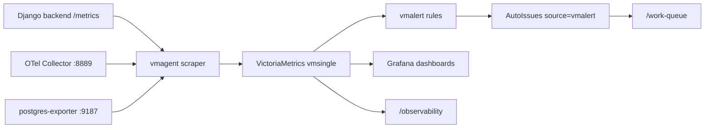

# FR — VictoriaMetrics And Grafana Observability Layer

[SPEC FRESHNESS: reviewed_at=2026-06-02 next_review=2026-09-02]

## Purpose

Add a durable time-series database, scraper, alert engine, Grafana dashboards, AutoIssue picker source, gap detector, and `/observability` stack-health GUI.

## Sources Of Truth

- VictoriaMetrics single-server documentation, `https://docs.victoriametrics.com/victoriametrics/single-server-victoriametrics/`.
- VictoriaMetrics vmagent documentation, `https://docs.victoriametrics.com/vmagent/`.
- VictoriaMetrics vmalert documentation, `https://docs.victoriametrics.com/vmalert/`.
- Grafana Prometheus data source documentation, `https://grafana.com/docs/grafana/latest/datasources/prometheus/configure/`.
- Prometheus exposition format documentation, `https://prometheus.io/docs/instrumenting/exposition_formats/`.
- OpenMetrics specification, `https://github.com/OpenObservability/OpenMetrics/blob/main/specification/OpenMetrics.md`.

## Architecture

## Capacity Contract

VictoriaMetrics runs with:

- `-retentionPeriod=7d`
- `-dedup.minScrapeInterval=15s`
- `-storage.minFreeDiskSpaceBytes=536870912`
- `-storage.maxHourlyIngestionRate=300000`
- `-storage.maxDailySeries=200000`
- `-search.maxQueryDuration=30s`
- `-search.maxConcurrentRequests=8`

The target cap is 2 GB for seven days. The database enforces retention and refusal below 512 MB free. A vmalert rule files an AutoIssue before the storage budget is exceeded.

## Reserved Metric Registry

The first implementation registers the 75 planned names and exposes helper functions. Deep hot-path instrumentation is added through the registry, not scattered one-off metric objects.

The metrics cover import, cleaning, sentence splitting, embeddings, indexing, scoring, suggestions, review, crawlers, system health, high-cardinality controls, anomaly detection, stack health, module boundary rate/error/duration metrics, database/cache, Celery, AutoIssues, Paper Trail, hooks, artefacts, and external API budget.

## Behavior

### Scenario: stack foundation

Given the Docker stack starts,  
When VictoriaMetrics, vmagent, and vmalert run,  
Then vmsingle keeps seven days of deduped samples and Grafana has VictoriaMetrics as the default metrics data source.

### Scenario: backend metrics endpoint

Given the backend is running,  
When `/metrics` is requested with the configured token,  
Then the response is Prometheus text format and includes registered metric families.

### Scenario: vmalert source

Given vmalert reports a firing alert,  
When the vmalert picker runs,  
Then an AutoIssue with `source="vmalert"` is created or updated.

### Scenario: gap detector

Given a reserved metric or dashboard is missing,  
When the observability gap detector runs,  
Then an AutoIssue is filed with a deterministic Trap/Fix-shape lesson.

### Scenario: GUI stack page

Given the user opens `/observability`,  
When the backend stack endpoint returns statuses,  
Then the page shows one tile per observability service with dashboard links and missing-piece counts.

### Scenario: Error Log Grafana launcher

Given the user opens `/error-log`,  
When they need the full Grafana OSS dashboard,  
Then the page shows an Open Grafana button that opens `http://localhost:3000` in a new tab with `noopener,noreferrer`.

[SPEC CITED: feature=fr-observability-vm-grafana kind=technical_doc id=https://docs.victoriametrics.com/victoriametrics/single-server-victoriametrics/ verified_at=2026-06-02]
